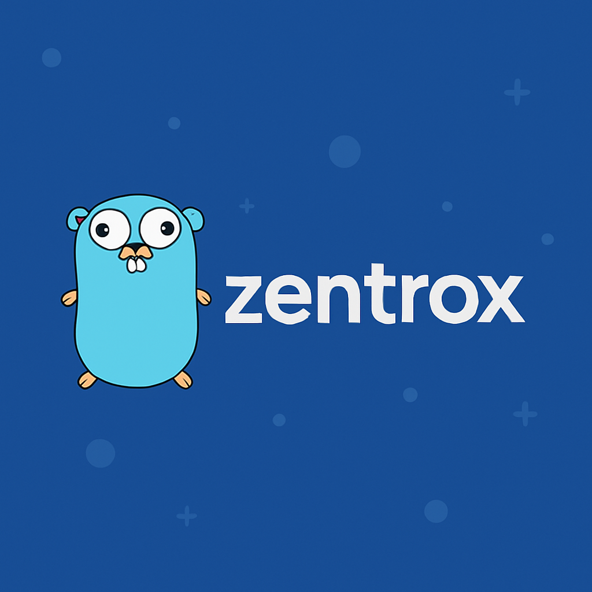

# Zentrox


A minimal, fast HTTP framework for Go with simple, clean API.

---

## Quick Start

```go
package main

import (
    "github.com/aminofox/zentrox"
    "github.com/aminofox/zentrox/middleware"
)

func main() {
    app := zentrox.NewApp()

    app.Plug(middleware.Recovery(), middleware.Logger())

    app.OnGet("/", func(c *zentrox.Context) {
        c.SendText(200, "Hello!")
    })

    app.OnGet("/users/:id", func(c *zentrox.Context) {
        c.SendJSON(200, map[string]string{"id": c.Param("id")})
    })

    app.Run(":8000")
}
```

---

## Installation

```bash
go get github.com/aminofox/zentrox
```

---

## Features

- ✅ **Minimal & Fast** - Only essential middleware included
- ✅ **Simple API** - Clean and easy to learn
- ✅ **Easy Integration** - Custom logger and JWT support for your existing systems
- ✅ **Automatic middleware chaining** - No manual `c.Next()` needed in handlers
- ✅ **Fast routing** - Compiled trie with path params and wildcards
- ✅ **Built-in essentials** - CORS, JWT, Gzip, logging, error handling
- ✅ **OpenAPI/Swagger support** - Auto-generate API documentation
- ✅ **Validation & binding** - Built-in request validation
- ✅ **Context pooling** - Zero allocations for high performance

---

## Routing

```go
app.OnGet("/path", handler)
app.OnPost("/path", handler)
app.OnPut("/path", handler)
app.OnPatch("/path", handler)
app.OnDelete("/path", handler)
```

### Path Parameters

```go
app.OnGet("/users/:id", func(c *zentrox.Context) {
    id := c.Param("id")
    c.SendJSON(200, map[string]string{"id": id})
})
```

### Wildcards

```go
app.OnGet("/files/*filepath", func(c *zentrox.Context) {
    path := c.Param("filepath")
    c.SendText(200, path)
})
```

### Route Groups

```go
api := app.Scope("/api")
api.OnGet("/users", listUsers)
api.OnPost("/users", createUser)
```

---

## Middleware

### Global Middleware

```go
app.Plug(
    middleware.Recovery(),
    middleware.Logger(),
    middleware.CORS(middleware.DefaultCORS()),
)
```

### Per-Route Middleware

```go
app.OnGet("/secure", authMiddleware, handler)
```

### Group Middleware

```go
admin := app.Scope("/admin", authMiddleware)
admin.OnGet("/stats", statsHandler)
```

### Custom Middleware

```go
func MyMiddleware() zentrox.Handler {
    return func(c *zentrox.Context) {
        // Before handler
        c.Next() // Call next middleware/handler
        // After handler
    }
}
```

### Built-in Middleware

Zentrox includes only essential middleware for a minimal footprint:

```go
middleware.Recovery()                           // Panic recovery
middleware.Logger()                             // Request logging
middleware.LoggerWithFunc(customLogFn)          // Custom logger integration
middleware.CORS(middleware.DefaultCORS())       // CORS headers
middleware.Gzip()                               // Response compression
middleware.JWT(middleware.DefaultJWT(secret))   // JWT auth
middleware.ErrorHandler(middleware.DefaultErrorHandler()) // Error handling
```

**Removed middleware** (keep your project minimal):
- ~~AccessLog~~ - Use `Logger` or `LoggerWithFunc` instead
- ~~RequestID~~ - Implement if needed for your use case
- ~~Metrics~~ - Use external observability tools
- ~~Timeout~~ - Configure at server level or reverse proxy
- ~~SimpleTrace~~ - Use proper APM/tracing solutions
- ~~BodyLimit~~ - Configure at reverse proxy level

---

## CORS (Simplified)

```go
app.Plug(middleware.CORS(middleware.CORSConfig{
    AllowOrigins:     []string{"http://localhost:3000"},
    AllowMethods:     []string{"GET", "POST", "PUT", "DELETE"},
    AllowHeaders:     []string{"Content-Type", "Authorization"},
    AllowCredentials: true,
    MaxAge:           3600,
}))
```

Or use defaults:

```go
app.Plug(middleware.CORS(middleware.DefaultCORS()))
```

---

## JWT (Simplified)

One simple config - no more separate JWT and JWTChecks:

```go
secret := []byte("your-secret-key")

app.Plug(middleware.JWT(middleware.JWTConfig{
    Secret:      secret,
    ContextKey:  "user",
    RequireExp:  true,
    Issuer:      "your-app",
    Audience:    "api",
    ClockSkew:   60 * time.Second,
    AllowedAlgs: []string{"HS256"},
}))
```

Or use defaults:

```go
app.Plug(middleware.JWT(middleware.DefaultJWT(secret)))
```

Get user in handler:

```go
app.OnGet("/me", func(c *zentrox.Context) {
    user, _ := c.Get("user")
    c.SendJSON(200, user)
})
```

---

## Binding & Validation

```go
type CreateUser struct {
    Name  string `json:"name" validate:"required,min=3,max=50"`
    Email string `json:"email" validate:"required,email"`
    Age   int    `json:"age" validate:"min=18,max=130"`
}

app.OnPost("/users", func(c *zentrox.Context) {
    var input CreateUser
    if err := c.BindJSONInto(&input); err != nil {
        c.Fail(400, "invalid input", err.Error())
        return
    }
    c.SendJSON(201, input)
})
```

Supported validators:
- `required` - field must be present
- `min=N`, `max=N` - min/max value or length
- `len=N` - exact length
- `email` - valid email
- `oneof=a b c` - value must be one of
- `regex=pattern` - match regex

---

## OpenAPI/Swagger

```go
b := openapi.New("My API", "1.0.0",
    openapi.WithServer("http://localhost:8000", "local"),
)

app.SetEnableOpenAPI(true).
    MountOpenAPI(b, "/openapi.json", "/docs")

app.OnGetDoc(b, "/users/:id", handler, 
    openapi.Op().
        SetSummary("Get user").
        ResponseJSON(200, User{}, "OK"),
)
```

Visit `http://localhost:8000/docs` for Swagger UI.

---

## Context API

```go
// Input
c.Param("id")           // Path parameter
c.Query("q")            // Query parameter
c.GetHeader("X-Token")  // Request header

// Binding
c.BindJSONInto(&dst)    // Bind & validate JSON
c.BindFormInto(&dst)    // Bind & validate form
c.BindQueryInto(&dst)   // Bind & validate query

// Output
c.SendJSON(200, data)   // Send JSON
c.SendText(200, "ok")   // Send text
c.SendHTML(200, html)   // Send HTML
c.SendFile(path)        // Send file
c.SetHeader("X-ID", id) // Response header

// Storage
c.Set("key", value)     // Store value
c.Get("key")            // Retrieve value
```

---

## Performance

Zentrox is designed for speed:
- Context pooling (zero allocations per request)
- Fast routing (compiled trie)
- Efficient middleware chain

Benchmarks on Apple M1 Pro:
- ~1M rps for static routes
- ~900K rps for parameterized routes
- ~740K rps for JSON responses

---

## Complete Example

```go
package main

import (
    "github.com/aminofox/zentrox"
    "github.com/aminofox/zentrox/middleware"
    "time"
)

type User struct {
    ID    string `json:"id"`
    Name  string `json:"name"`
    Email string `json:"email" validate:"required,email"`
}

func main() {
    app := zentrox.NewApp()

    // Global middleware
    app.Plug(
        middleware.CORS(middleware.DefaultCORS()),
        middleware.Recovery(),
        middleware.Logger(),
    )

    // Public routes
    app.OnGet("/", func(c *zentrox.Context) {
        c.SendText(200, "Welcome to Zentrox!")
    })

    app.OnGet("/ping", func(c *zentrox.Context) {
        c.SendJSON(200, map[string]string{"status": "ok"})
    })

    // API routes
    api := app.Scope("/api")
    
    api.OnGet("/users/:id", func(c *zentrox.Context) {
        user := User{
            ID:    c.Param("id"),
            Name:  "John Doe",
            Email: "john@example.com",
        }
        c.SendJSON(200, user)
    })

    api.OnPost("/users", func(c *zentrox.Context) {
        var user User
        if err := c.BindJSONInto(&user); err != nil {
            c.Fail(400, "invalid input", err.Error())
            return
        }
        user.ID = "generated-id"
        c.SendJSON(201, user)
    })

    // Protected routes
    secret := []byte("your-secret-key")
    admin := app.Scope("/admin", middleware.JWT(middleware.JWTConfig{
        Secret:     secret,
        RequireExp: true,
    }))

    admin.OnGet("/stats", func(c *zentrox.Context) {
        c.SendJSON(200, map[string]int{
            "users":  100,
            "orders": 50,
        })
    })

    app.Run(":8000")
}
```

---

## Migration from Old API

If you're upgrading from older versions:

### Middleware Changes
- ✅ `c.Forward()` → `c.Next()` (automatic in middleware)
- ✅ `CORS` + `StrictCORS` → Single `CORS` config
- ✅ `JWT` + `JWTChecks` → Single `JWT` config

### What Stayed the Same
- ✅ All route methods (`OnGet`, `OnPost`, etc.)
- ✅ Context API (`Param`, `Query`, `SendJSON`, etc.)
- ✅ Binding and validation
- ✅ Performance optimizations

---

## Why Zentrox?

- **Minimal by Design**: Only 6 essential middleware - no bloat, easy to understand
- **Clean API**: Less boilerplate, cleaner patterns, better defaults
- **Easy Integration**: Custom logger and JWT support to fit your existing systems
- **Faster routing**: Compiled trie-based router with ~2M rps
- **Better defaults**: Security and performance out of the box
- **Modern features**: Built-in OpenAPI, validation, automatic middleware chaining
- **Production-ready**: Context pooling, panic recovery, zero allocations

---

## License

MIT
