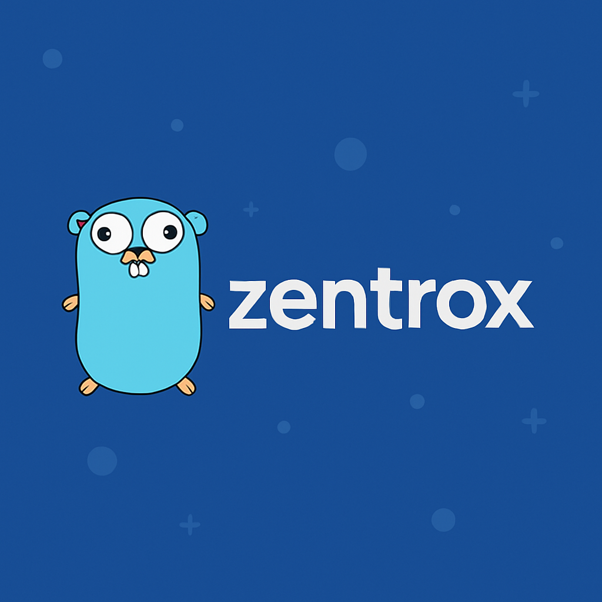

# Zentrox


A minimal, fast HTTP framework for Go with simple, clean API.

---

## Quick Start

```go
package main

import (
    "github.com/aminofox/zentrox/v2"
    "github.com/aminofox/zentrox/v2/middleware"
)

func main() {
    app := zentrox.NewApp()

    app.Plug(middleware.Recovery(), middleware.Logger())

    app.GET("/", func(c *zentrox.Context) {
        c.String(200, "Hello!")
    })

    app.GET("/users/:id", func(c *zentrox.Context) {
        c.JSON(200, map[string]string{"id": c.Param("id")})
    })

    app.Run(":8000")
}
```

---

## Installation

```bash
go get github.com/aminofox/zentrox/v2
```

---

## Features

- ✅ **Minimal & Fast** - Only essential middleware included
- ✅ **Simple API** - Clean and easy to learn
- ✅ **Easy Integration** - Custom logger and JWT support for your existing systems
- ✅ **Automatic middleware chaining** - No manual `c.Next()` needed in handlers
- ✅ **Fast routing** - Compiled trie with path params and wildcards
- ✅ **Built-in essentials** - CORS, JWT, Gzip, logging, error handling
- ✅ **HTTP hardening middleware** - Security headers, request limits, method/URI guards
- ✅ **Validation & binding** - Built-in request validation
- ✅ **Context pooling** - Zero allocations for high performance

---

## Routing

```go
app.GET("/path", handler)
app.POST("/path", handler)
app.PUT("/path", handler)
app.PATCH("/path", handler)
app.DELETE("/path", handler)
```

### Path Parameters

```go
app.GET("/users/:id", func(c *zentrox.Context) {
    id := c.Param("id")
    c.JSON(200, map[string]string{"id": id})
})
```

### Wildcards

```go
app.GET("/files/*filepath", func(c *zentrox.Context) {
    path := c.Param("filepath")
    c.String(200, "File path: %s", path)
})
```

### Route Groups

```go
api := app.Scope("/api")
api.GET("/users", listUsers)
api.POST("/users", createUser)
```

---

## Middleware

### Global Middleware

```go
app.Plug(
    middleware.Recovery(),
    middleware.Logger(),
    middleware.CORS(middleware.DefaultCORS()),
)
```

### Per-Route Middleware

```go
app.GET("/secure", authMiddleware, handler)
```

### Group Middleware

```go
admin := app.Scope("/admin", authMiddleware)
admin.GET("/stats", statsHandler)

// Or add middleware after creating the group
apiGroup := app.Scope("/api")
apiGroup.Use(authMiddleware)
apiGroup.GET("/users", listUsers)
```

### Custom Middleware

```go
func MyMiddleware() zentrox.Handler {
    return func(c *zentrox.Context) {
        // Before handler
        c.Next() // Call next middleware/handler
        // After handler
    }
}
```

### Built-in Middleware

Zentrox includes essential middleware plus lightweight utilities:

```go
middleware.Recovery()                           // Panic recovery
middleware.Logger()                             // Request logging
middleware.LoggerWithFunc(customLogFn)          // Custom logger integration
middleware.CORS(middleware.DefaultCORS())       // CORS headers
middleware.Gzip()                               // Response compression
middleware.JWT(middleware.JWTConfig{Secret: secret}) // JWT auth
middleware.ErrorHandler(middleware.DefaultErrorHandler()) // Error handling
middleware.RequestID(middleware.DefaultRequestID()) // Request ID propagation
middleware.RateLimit(middleware.DefaultRateLimit()) // Token-bucket rate limit
middleware.Timeout(2 * time.Second)             // Request context timeout
middleware.SecurityHeaders(middleware.DefaultSecurityHeaders()) // Baseline security headers
middleware.HTTPProtection(middleware.DefaultHTTPProtection()) // Method + URI guards
middleware.BodyLimit(middleware.DefaultBodyLimit()) // Request body size limit
middleware.ConcurrencyLimit(middleware.DefaultConcurrencyLimit()) // In-flight request cap
middleware.DefaultAPIHardening()... // Preset stack (use with app.Plug)
middleware.DefaultAPIHardeningFast()... // Lower-overhead preset
```

## CORS (Simplified)

```go
app.Plug(middleware.CORS(middleware.CORSConfig{
    AllowOrigins:     []string{"http://localhost:3000"},
    AllowMethods:     []string{"GET", "POST", "PUT", "DELETE"},
    AllowHeaders:     []string{"Content-Type", "Authorization"},
    AllowCredentials: true,
    MaxAge:           3600,
}))
```

Or use defaults:

```go
app.Plug(middleware.CORS(middleware.DefaultCORS()))
```

---

## JWT (Simplified)

One simple config - no more separate JWT and JWTChecks:

```go
import (
    "errors"
    "time"
)

secret := []byte("your-secret-key")

app.Plug(middleware.JWT(middleware.JWTConfig{
	Secret:     secret,
	ContextKey: "user",
	ValidateFunc: func(claims map[string]any) error {
		if exp, ok := claims["exp"].(float64); ok && time.Now().Unix() > int64(exp) {
			return errors.New("token expired")
		}
		return nil
	},
}))
```

Get user in handler:

```go
app.GET("/me", func(c *zentrox.Context) {
    user, _ := c.Get("user")
    c.JSON(200, user)
})
```

## Request ID

```go
app.Plug(middleware.RequestID(middleware.DefaultRequestID()))

app.GET("/trace", func(c *zentrox.Context) {
    c.JSON(200, map[string]any{"request_id": c.RequestID()})
})
```

## Rate Limit

```go
app.Plug(middleware.RateLimit(middleware.RateLimitConfig{
    Rate:  20, // requests/sec
    Burst: 40,
    KeyFunc: func(c *zentrox.Context) string {
        return c.RealIP()
    },
}))
```

## Timeout

```go
app.Plug(middleware.Timeout(2 * time.Second))

app.GET("/slow", func(c *zentrox.Context) {
    select {
    case <-time.After(3 * time.Second):
        c.String(200, "done")
    case <-c.Done():
        return
    }
})
```

---

## Security Headers

```go
app.Plug(middleware.SecurityHeaders(middleware.DefaultSecurityHeaders()))
```

Custom config:

```go
app.Plug(middleware.SecurityHeaders(middleware.SecurityHeadersConfig{
    XContentTypeOptions: "nosniff",
    XFrameOptions:       "SAMEORIGIN",
    ReferrerPolicy:      "strict-origin",
    Extra: map[string]string{
        "Permissions-Policy": "geolocation=()",
    },
}))
```

## HTTP Protection

```go
app.Plug(middleware.HTTPProtection(middleware.HTTPProtectionConfig{
    AllowedMethods: []string{"GET", "POST", "PUT", "PATCH", "DELETE", "OPTIONS", "HEAD"},
    MaxURLLength:   2048,
}))
```

## Body Limit

```go
app.Plug(middleware.BodyLimit(middleware.BodyLimitConfig{
    MaxBytes: 1 << 20, // 1 MiB
}))
```

## Concurrency Limit

```go
app.Plug(middleware.ConcurrencyLimit(middleware.ConcurrencyLimitConfig{
    MaxConcurrent: 512,
    QueueTimeout:  50 * time.Millisecond,
}))
```

Set `QueueTimeout: 0` to reject immediately when all slots are busy.

## Default API Hardening (Preset)

Use the optimized preset directly:

```go
app.Plug(middleware.DefaultAPIHardening()...)
```

Or tune defaults:

```go
cfg := middleware.DefaultAPIHardeningConfig()
cfg.BodyLimit.MaxBytes = 2 << 20 // 2 MiB
cfg.ConcurrencyLimit.MaxConcurrent = 1024
cfg.Timeout = 1500 * time.Millisecond

app.Plug(middleware.APIHardening(cfg)...)
```

## Default API Hardening Fast (Preset)

Use this when you want lower middleware overhead and can skip request-id/timeout:

```go
app.Plug(middleware.DefaultAPIHardeningFast()...)
```

Tune fast preset:

```go
cfg := middleware.DefaultAPIHardeningFastConfig()
cfg.ConcurrencyLimit.MaxConcurrent = 1536
cfg.RateLimit.Rate = 50
cfg.RateLimit.Burst = 100

app.Plug(middleware.APIHardeningFast(cfg)...)
```

For API services, a practical default stack is: `RequestID + SecurityHeaders + HTTPProtection + BodyLimit + ConcurrencyLimit + RateLimit + Timeout`.

Performance note: these hardening middleware precompute config and keep per-request work lightweight. You can measure impact with:

```bash
go test ./z_test -bench BenchmarkRPS_ -benchmem
go test ./z_test -run '^$' -bench BenchmarkMiddlewareCost_ -benchmem
```

---

## Binding & Validation

```go
type CreateUser struct {
    Name  string `json:"name" validate:"required,min=3,max=50"`
    Email string `json:"email" validate:"required,email"`
    Age   int    `json:"age" validate:"min=18,max=130"`
}

app.POST("/users", func(c *zentrox.Context) {
    var input CreateUser
    if err := c.BindJSONInto(&input); err != nil {
        c.Fail(400, "invalid input", err.Error())
        return
    }
    c.JSON(201, input)
})
```

Supported validators:
- `required` - field must be present
- `min=N`, `max=N` - min/max value or length
- `len=N` - exact length
- `email` - valid email
- `oneof=a b c` - value must be one of
- `regex=pattern` - match regex

---

For more examples, see `examples/` (including `examples/platform_middleware/`).

## Examples Matrix

- `examples/minimal/` - Minimal setup: custom logger, JWT sign + protected route with claim validation
- `examples/basic/` - Core routing, lifecycle hooks, static files, file upload
- `examples/binding/` - JSON/form/query binding + validation
- `examples/graceful/` - `Start` + graceful `Shutdown` with signals and health endpoints
- `examples/platform_middleware/` - `DefaultAPIHardening` preset with tuned RateLimit/Timeout

---

## Context API

```go
// Input
c.Param("id")           // Path parameter
c.Query("q")            // Query parameter
c.GetHeader("X-Token")  // Request header

// Binding
c.BindJSONInto(&dst)    // Bind & validate JSON
c.BindFormInto(&dst)    // Bind & validate form
c.BindQueryInto(&dst)   // Bind & validate query

// Output
c.JSON(200, data)       // Send JSON
c.String(200, "ok")     // Send text (with format support)
c.HTML(200, html)       // Send HTML
c.XML(200, data)        // Send XML
c.Data(200, "text/plain", bytes)  // Send raw bytes
c.SendStatus(200)       // Send status only
c.SetHeader("X-ID", id) // Response header

// Storage
c.Set("key", value)     // Store value
c.Get("key")            // Retrieve value
```

---

## Performance

Zentrox is designed for speed:
- Context pooling (zero allocations per request)
- Fast routing (compiled trie)
- Efficient middleware chain

Benchmarks on Apple M1 Pro:
- ~1M rps for static routes
- ~900K rps for parameterized routes
- ~740K rps for JSON responses

---

## Complete Example

```go
package main

import (
    "github.com/aminofox/zentrox/v2"
    "github.com/aminofox/zentrox/v2/middleware"
    "time"
)

type User struct {
    ID    string `json:"id"`
    Name  string `json:"name"`
    Email string `json:"email" validate:"required,email"`
}

func main() {
    app := zentrox.NewApp()

    // Global middleware
    app.Plug(
        middleware.CORS(middleware.DefaultCORS()),
        middleware.Recovery(),
        middleware.Logger(),
    )

    // Public routes
    app.GET("/", func(c *zentrox.Context) {
        c.String(200, "Welcome to Zentrox!")
    })

    app.GET("/ping", func(c *zentrox.Context) {
        c.JSON(200, map[string]string{"status": "ok"})
    })

    // API routes
    api := app.Scope("/api")
    
    api.GET("/users/:id", func(c *zentrox.Context) {
        user := User{
            ID:    c.Param("id"),
            Name:  "John Doe",
            Email: "john@example.com",
        }
        c.JSON(200, user)
    })

    api.POST("/users", func(c *zentrox.Context) {
        var user User
        if err := c.BindJSONInto(&user); err != nil {
            c.Fail(400, "invalid input", err.Error())
            return
        }
        user.ID = "generated-id"
        c.JSON(201, user)
    })

    // Protected routes
    secret := []byte("your-secret-key")
    admin := app.Scope("/admin", middleware.JWT(middleware.JWTConfig{
        Secret: secret,
    }))

    admin.GET("/stats", func(c *zentrox.Context) {
        c.JSON(200, map[string]int{
            "users":  100,
            "orders": 50,
        })
    })

    app.Run(":8000")
}
```

---

## Why Zentrox?

- **Minimal by Design**: Focused middleware set - no bloat, easy to understand
- **Clean API**: Less boilerplate, cleaner patterns, better defaults
- **Easy Integration**: Custom logger and JWT support to fit your existing systems
- **Faster routing**: Compiled trie-based router with ~2M rps
- **Better defaults**: Security and performance out of the box
- **Modern features**: Validation, HTTP hardening middleware, automatic middleware chaining
- **Production-ready**: Context pooling, panic recovery, zero allocations

---

## License

MIT
